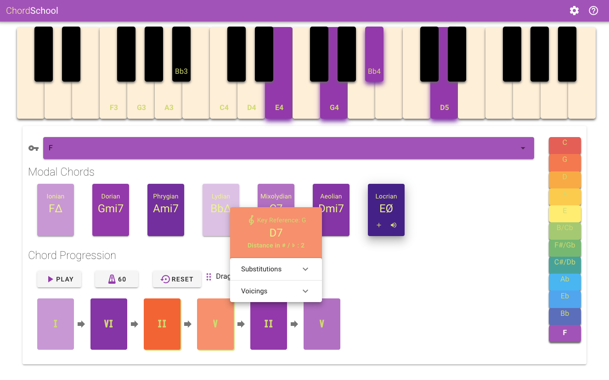
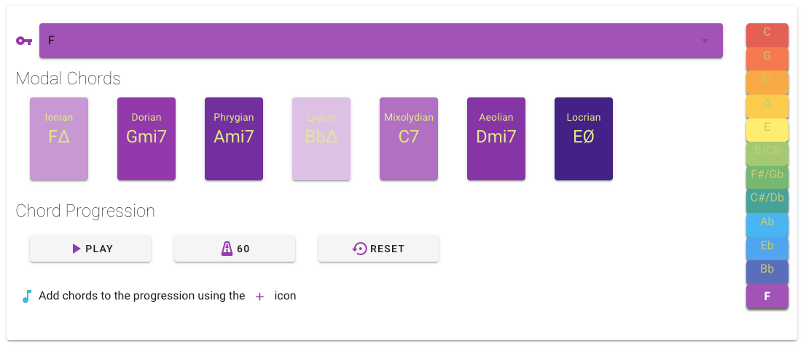
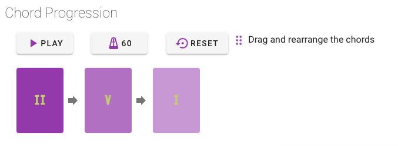
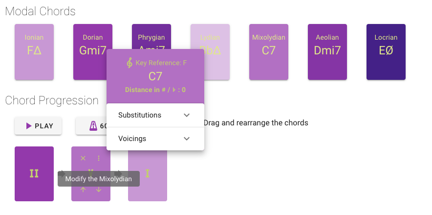
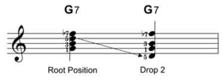
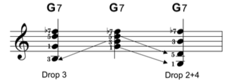

# ACTAM Project 

## Web-based Educational application to visualize Major Scale harmony chords and scales 



## Introduction

As a project for the Advanced Coding Tools and Methodologies course we developed a Vue.js desktop application that allows the user to build chord progressions and allows him to experiment with possible substitutions and voicings according to the rules of major scale harmony and hear the result. The app is configured to run in all screen sizes and major browsers, so it's totally cross-platform and available for every desktop OS.

Our application is focused on the educational aspect of Major Scale harmony, thus we chose to visually represent the key references, the relative chords and modes as colors as well as notes over the keyboard so to help the user visualise the relevant music theory.

## User Interface

The ChordSchool user interfaces consists of the following  main components:
1. The **Keyboard** that extends over three octaves and is displaying the notes composing the major scale of reference as well as  the placement of fingers over the it for the modal chords in their first position as well as all the possible alterations when applied by the user. Please note that the keyboard is available for medium and above screen sizes.

2. The **control panel** where the user mainly interacts with the application. The user is able to create the chord progression of his choice, by placing a series of chords available from the seven modes of the reference scale. The user can reorder the progression by dragging its elements and hear the final result in different sound environments and configurable playout speed. As the user interacts with the control panel, the keyboard highlights his choices and helps him position himself over the keyboard as a player. The control panel is available for all screen sizes.

## How to Use

The ChordSchool app workflow can be summarized by the following steps:

1. Select the key reference using the selector. Each key is assigned a color 
according to their positioning on the circle of 5ths, which is displayed in the palette on the right section of the control panel.  


2. The modes of the selected reference scale are displayed in the Modal Chords section. 
Each mode is assigned a specific background color variant, according to the brightness or darkness of the mode.
For example the Lydian mode is assigned the brightest variant while Locrian mode the darkest.
The selected Key position is highlighted in the palette and the name of the notes relative to the scale are placed on the keyboard. 



3. The hovering action reveals the fingering over the keyboard and the action buttons:
    * **Add** the chord to Chord Progression section.
    * **Listen** to the chord over in its first position fingering over the scale.


 
4. The added chords appear in the Chord Progression section, in the order of selection.



5. Hovering over the progression list chords reveals the fingering over the keyboard board and additional action buttons

   * **Drag** the chord within the Chord Progression section to rearrange it as needed.
   * **Move** the chord over the keyboard up or down an octave
   * **View** the chord Details menu using the Details button. The Details screen and its options are described in depth in the following section **Chord Alterations**  
   * **Remove** the chord if it is not needed
    


7. In the Chord Progression section the user can: 

    * **Play** the progression and view the fingering of the chords as the playout is moving forward in time,using the relative PLAY button
    + **Adjust** the BPM ** of the playout speed using the relative BPM button. 
    * **Reset** the current progression and delete all the selected chords using the RESET Button.

## Chord Alterations

### Substitutions
In music theory, chord substitution is the technique of using a chord in place of another in a progression of chords. Much of the European classical repertoire and the vast majority of blues, jazz and rock music songs are based on chord progressions. "A chord substitution occurs when a chord is replaced by another that is made to function like the original. Usually substituted chords possess two pitches in common with the triad that they are replacing."

In the context of major scale harmony we chose to implement the following substitution mechanisms:
 
* **Tritone substitution**
The tritone substitution can be performed by exchanging a dominant seven (V degree) chord for another dominant seven chord which is a tritone away from it. For example, in the key of C major one can use D♭7 instead of G7. (D♭ is a tritone away from G).

* **Secondary dominant**
A secondary dominant is any chord that has the dominant function over another chord that is not the tonic of the song.
For example, in the key of C major, the dominant chord is G7. If, in that tonality, the A7 chord appeared, that chord would be a “secondary dominant”, since it is a dominant that resolves in D, not in C (our tonic in this case).

* **ii-V substitution**
The ii-V substitution is when a chord or each chord in a progression is preceded by its supertonic (ii7) and dominant (V7), or simply its dominant. For example, a C major chord would be preceded by Dm7 and G7. Since secondary dominant chords are often inserted between the chords of a progression rather than replacing one, this may be considered as 'addition' rather than 'substitution'.

* **Quality substitution**
Chord quality substitution is when the quality of a chord is changed, from major to minor or vice versa, so the new substitute chord has similar root and construction but with one pitch different. 

* **Relative major-minor substitution** 
The relative major/minor substitution shares two common tones and is so called because it involves the relation between major and minor keys with the same key signatures, such as C major and A minor.

* **Tonic substitution**
Tonic substitution is the use of chords that sound similar to the tonic chord (or I chord) in place of the tonic. In major keys, the chords iii and vi are often substituted for the I chord, to add interest. Both of the tonic substitute chords use notes from the tonic chord, which means that they usually support a melody originally designed for the tonic (I) chord.

### Voicings

In music theory, voicing refers to one of two closely related concepts:
* How a musician or group distributes, or spaces, notes and chords on one or more instruments
* The simultaneous vertical placement of notes in relation to each other.


One nomenclature for describing certain classes of voicings is the "drop-n" terminology, such as drop-2 voicings, drop-4 voicings, etc. This system views voicings as built from the top down. The highest voice is the first voice or voice 1. The second-highest voice is voice 2, etc. 

A dropped voicing lowers one or more voices by an octave relative to the default state.
    



We focused our implementation to the vertical spacing of notes inside a single chord:
* **drop-2**  
* **drop-3**
* **drop-2+4**
* **Add 9th**
* **Add 9th - No 5th**


The above described chord alterations are accessible in the Chord Detailed menu along with other useful information


The keyboard is displaying

## Technologies Used

### Vue

### Vuex

### Vuetify

### ToneJS


## Video Demo
Here's a short demo of our project --> [Demo]()


## Project setup
```
npm install
```

### Compiles and hot-reloads for development
```
npm run serve
```

### Compiles and minifies for production
```
npm run build
```

### Lints and fixes files
```
npm run lint
```

### Customize configuration
See [Configuration Reference](https://cli.vuejs.org/config/).

Developed by
- Massi Oliviero (mail: oliviero.massi@mail.polimi.it)
- Fotios Koutsoukos (mail: fotios.koutsoukos@mail.polimi.it)
- Soroush Jamali (mail: soroush.jamali@mail.polimi.it)
