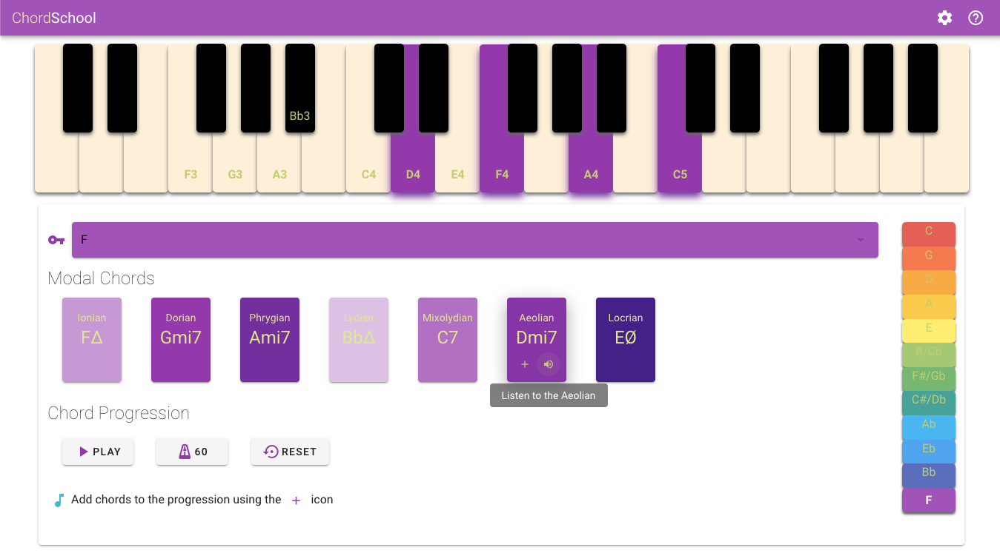

# ACTAM Project 

## Web-based Educational application to visualize Major Scale harmony chords and scales 


## Introduction

As a project for the Advanced Coding Tools and Methodologies course we developed a Vue.js desktop application that allows the user to build chord progressions and allows him to experiment with possible substitutions and voicings according to the rules of major scale harmony and hear the result. The app is configured to run in all screen sizes and major browsers, so it's totally cross-platform and available for every desktop OS.

## User Interface

The ChordSchool user interfaces consists of the following  main components:
1. The **Keyboard** that extends over three octaves and is displaying the notes composing the major scale of reference as well as  the placement of fingers over the it for the modal chords in their first position as well as all the possible alterations when applied by the user. Please note that the keyboard is available for medium and above screen sizes.

2. The **control panel** where the user mainly interacts with the application. The user is able to create the chord progression of his choice, by placing a series of chords available from the seven modes of the reference scale. The user can reorder the progression by dragging its elements and hear the final result in different sound environments and configurable playout speed. As the user interacts with the control panel, the keyboard highlights his choices and helps him position himself over the keyboard as a player. The control panel is available for all screen sizes.

## How to Use

The ChordSchool app workflow can be summarized by the following steps:

1. Select the key reference using the selector. Each key is assigned a color 
according to their positioning on the circle of 5ths, which is displayed in the palette on the right section of the control panel.  


2. The modes of the selected reference scale are displayed in the Modal Chords section. 
Each mode is assigned a specific background color variant, according to the brightness or darkness of the mode.
For example the Lydian mode is assigned the brightest variant while Locrian mode the darkest.
The selected Key position is highlighted in the palette and the name of the notes relative to the scale are placed on the keyboard. 


3. The hovering action reveals the fingering over the keyboard and the action buttons:
    >a. **Add** the chord to Chord Progression section.
    >b. **Listen** to the chord over in its first position fingering over the scale


 
4. The added chords appear in the Chord Progression section, in the order of selection.


5. Hovering over the progression list chords reveals the fingering over the keyboard board and additional action buttons

    >a. **Drag** the chord within the Chord Progression section to rearrange it as needed.
    >b. **Move** the chord over the keyboard up or down an octave
    >c. **View** the chord Details menu using the Experiment on the chord by applying the possible substitutions 
    or voicings on the selected chord. 
    >d. **Remove** the chord if it is not needed
    


7. Hear the result and view the fingering of the chord progression by pressing the Play button. The playout speed can be controlled by the BPM button. The progression can be deleted by  


Since our application is considered educational, we chose to visually represent the key references of the major scale harmony, the relative chords and modes in the context of color as well as in the context of placement of fingers over the keyboard as the chord progression is 


The keyboard is displaying

## Technologies Used

### Vue

### Vuex

### Vuetify

### ToneJS


## Video Demo
Here's a short demo of our project --> [Demo]()


## Project setup
```
npm install
```

### Compiles and hot-reloads for development
```
npm run serve
```

### Compiles and minifies for production
```
npm run build
```

### Lints and fixes files
```
npm run lint
```

### Customize configuration
See [Configuration Reference](https://cli.vuejs.org/config/).

Developed by
- Massi Oliviero (mail: oliviero.massi@mail.polimi.it)
- Fotios Koutsoukos (mail: fotios.koutsoukos@mail.polimi.it)
- Soroush Jamali (mail: soroush.jamali@mail.polimi.it)
